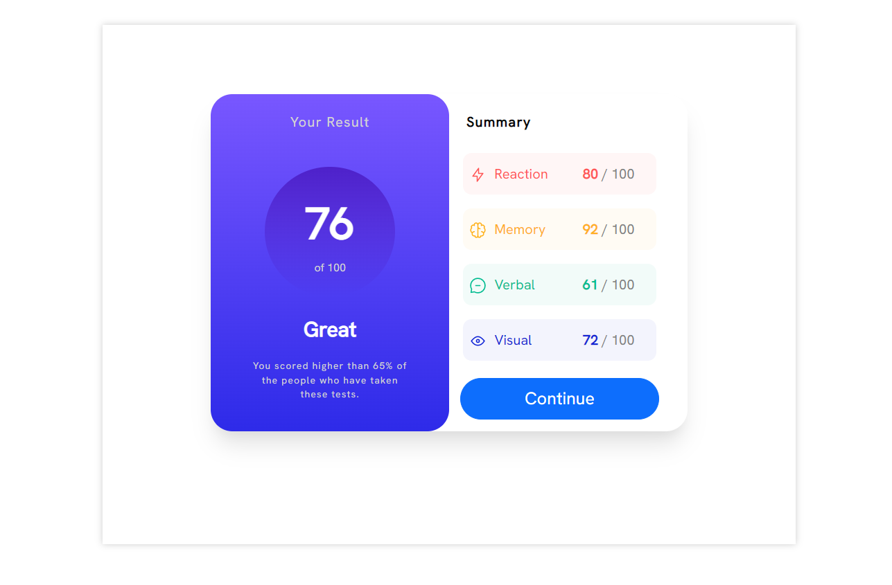
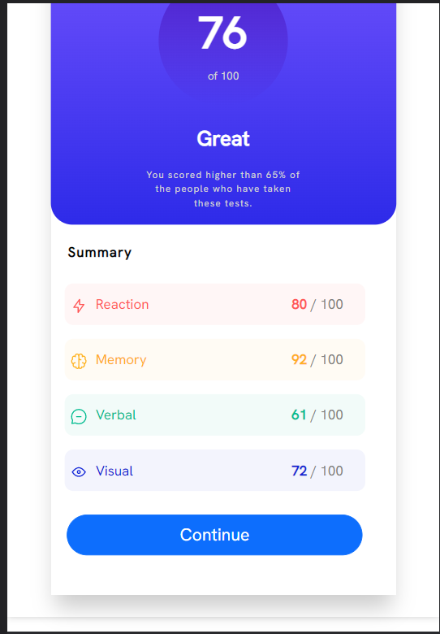

# Frontend Mentor - Results summary component solution

This is a solution to the [Results summary component challenge on Frontend Mentor](https://www.frontendmentor.io/challenges/results-summary-component-CE_K6s0maV). Frontend Mentor challenges help you improve your coding skills by building realistic projects.

## Table of contents

- [Overview](#overview)
  - [The challenge](#the-challenge)
  - [Screenshot](#screenshot)
- [My process](#my-process)
  - [Built with](#built-with)
  - [What I learned](#what-i-learned)
- [Author](#author)

## Overview

### The challenge

Users should be able to:

- View the optimal layout for the interface depending on their device's screen size
- See hover and focus states for all interactive elements on the page

### Screenshot



### Mobile View



## My process

### Built with

- HTML5
- CSS3

### What I learned

- Using css variables to easily adjust color and background-color.

```css
.reaction {
  color: var(--light-red);
  background-color: var(--light-red-secondary);
}

.memory {
  color: var(--orangey-yellow);
  background-color: var(--orangey-yellow-secondary);
}

.verbal {
  color: var(--green-teal);
  background-color: var(--green-teal-secondary);
}

.visual {
  color: var(--cobalt-blue);
  background-color: var(--cobalt-blue-secondary);
}
```

## Author

- Frontend Mentor - [@viditvarshney](https://www.frontendmentor.io/profile/viditvarshney)
